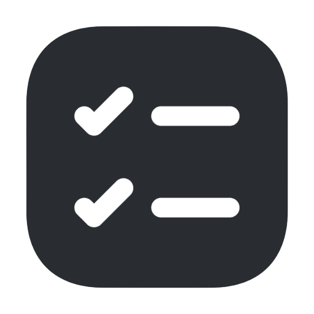
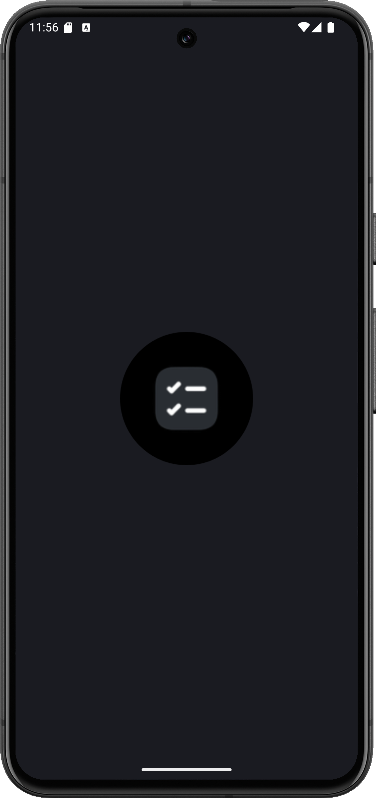
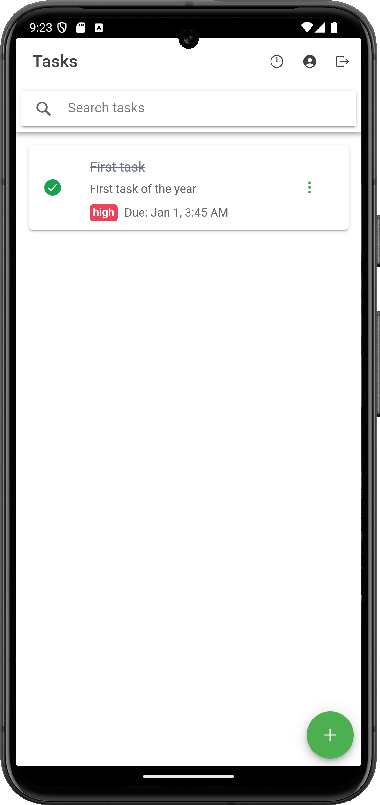
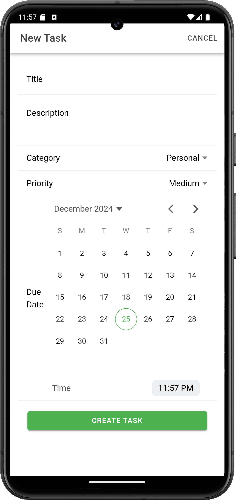

# Task Master

<p align="center">
  
</p>

## Project Overview

Task Master is an Ionic-based mobile application that helps users manage tasks efficiently. The app is designed to be simple yet powerful, allowing users to track their tasks and stay organized.

## To Be Lived and App Will Be Uploaded Soon!

.apk will be uploaded with the some known bug fixed within some days/weeks. 

### Screenshots

<div style="display: grid; grid-template-columns: repeat(2, 1fr); gap: 20px; overflow: hidden; max-width: 100%; justify-items: center;">
  
  
  
</div>


---

## Prerequisites

Before you begin, make sure you have the following installed on your local machine:

- **Node.js** (v14.x or later): [Download Node.js](https://nodejs.org/)
- **Ionic CLI**: Install it globally using npm:
  ```bash
  npm install -g @ionic/cli
  ```
- **Git**: Install Git if you don't already have it: [Git Downloads](https://git-scm.com/downloads)
- **Android Studio** (for running on Android Emulator): [Android Studio Setup](https://developer.android.com/studio)

---

## Getting Started

### 1. Clone the Repository

Clone the project to your local machine using Git:

```bash
git clone https://github.com/Lusan-sapkota/Task-Master.git
cd Task-Master
```

### 2. Install Dependencies

Install the required Node.js modules using npm:

```bash
npm install
```

This will install all the dependencies required for the app to run.

### 3. Run the App Locally

To run the Ionic app in the browser for testing:

```bash
ionic serve
```

This will launch the app in your browser at `http://localhost:8100`.

### 4. Running the App on Android Emulator

To run the app on an Android Emulator (assuming you have Android Studio set up), follow these steps:

- Ensure you have set up an Android emulator via Android Studio.
- Run the following command to build and deploy the app on the emulator:

```bash
npx cap copy android
npx cap open android
```

This will open Android Studio, where you can run the app on your emulator or connected device.

---

## Future Updates & Bug Fixes

- **Future Updates:** We are actively working on improving the app with new features and enhancements.
- **Bug Fixes:** Known bugs are being tracked, and fixes will be rolled out in future versions.

Stay tuned for updates by following the repository!

---

## License

This project is licensed under the **CC BY-NC 4.0** license. See the [LICENSE](LICENSE) file for more details.

---

## Contributing

We welcome contributions! If you find any issues or have suggestions for improvements, feel free to open an issue or submit a pull request.

1. Fork the repository
2. Create a new branch
3. Make your changes
4. Commit and push your changes
5. Open a pull request

---

## Contact

For any questions or suggestions, feel free to contact me directly at [Sapkotalusan@gmail.com].
